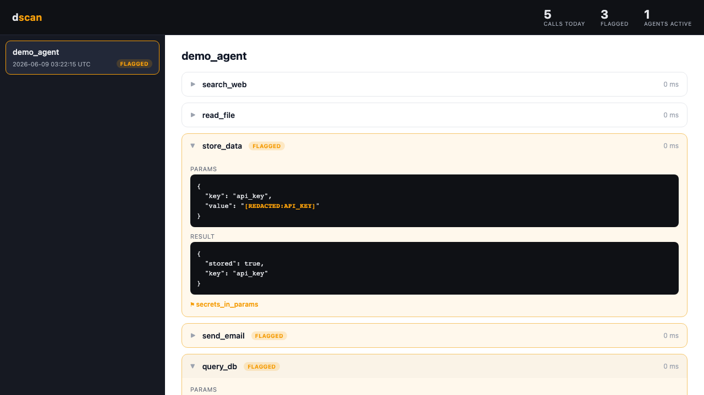

# dscan

[](https://github.com/DeepScan-Security/dscan/actions/workflows/ci.yml)

[](https://pypi.org/project/dscan-security/)
[](https://pypi.org/project/dscan-security/)


An open source agent security suite. Trace and redact your agent's tool
calls, scan its prompts and MCP configs, and detect suspicious call
chains — then inspect everything in a local dashboard.

```bash
pip install dscan-security
```

The package installs as `dscan-security`; the import path and CLI stay
`dscan` (`import dscan`, `dscan --help`).



## Quick start

```python
from dscan import watch

@watch
async def my_agent(task: str):
    ...  # your agent code, unchanged
```

Run your agent, then open the dashboard:

```bash
dscan dashboard
```

Tool calls are written as redacted NDJSON to `~/.dscan/traces/` (override
with `DSCAN_TRACES_DIR`). Wrapping any tool with `@watch.tool` traces its
params and result; if you use the Anthropic SDK, `@watch` also intercepts
`messages.create()` and traces each `tool_use` block.

## What dscan catches

| Capability | What it detects |
| --- | --- |
| `@watch` (tracing) | Every tool call — name, params, result, duration — written as redacted NDJSON; flags calls whose params contain secrets |
| Redaction | AWS keys, Anthropic/OpenAI/GitHub/Stripe tokens, JWTs, emails, phone numbers, SSNs, Luhn-valid credit cards, database-URL passwords, high-entropy secrets |
| `dscan scan` | Permissive prompts, injection-prone prompts, hardcoded secrets, excessive tool scope; unverified, overprivileged, and credential-leaking MCP servers |
| `dscan trail` | Suspicious tool-call sequences across an agent run (exfiltration, recon, injection relay, data staging, goal drift) |
| `dscan dashboard` | Local web UI: sessions, per-call timeline, redacted values, secrets flags, and trail findings |

## Commands

### `dscan scan`

Static analysis of system prompts and MCP config files in a directory.
Exits `1` if any high-severity issue is found.

```text
$ dscan scan ./prompts
                                  HIGH (1)
┏━━━━━━━┳━━━━━━━━┳━━━━━━┳━━━━━━━━━━━━━━━━━━━━━━━━━━━━━┳━━━━━━━━━━━━━━━━━━━━━┓
┃ Rule  ┃ File   ┃ Line ┃ Message                     ┃ Snippet           ┃
┡━━━━━━━╇━━━━━━━━╇━━━━━━╇━━━━━━━━━━━━━━━━━━━━━━━━━━━━━╇━━━━━━━━━━━━━━━━━━━━━┩
│ SP003 │ sp.txt │    2 │ Hardcoded secret in prompt  │ ...sk-ant-api03... │
└───────┴────────┴──────┴─────────────────────────────┴───────────────────┘
✗ 1 high-severity finding(s).
```

### `dscan watch`

`@watch` is a decorator, not a runtime command. This prints a reminder:

```text
$ dscan watch
⚠ Add @watch to your agent function. See README for usage.
```

### `dscan trail`

Reads trace files and reports suspicious tool-call chains, grouped by
severity. Exits `1` on any high or critical finding. Supports
`--min-severity {low|medium|high|critical}` and `--json`.

```text
$ dscan trail ~/.dscan/traces/
┏━━━━━━━━━━┳━━━━━━━━━━━━━━━━━┳━━━━━━━━━━━━━━━━━━━━━━━━━┳━━━━━━━━━━━━━━━┳━━━━━━━━━━━━┓
┃ Severity ┃ Pattern         ┃ Tools Involved          ┃ Message       ┃ Confidence ┃
┡━━━━━━━━━━╇━━━━━━━━━━━━━━━━━╇━━━━━━━━━━━━━━━━━━━━━━━━━╇━━━━━━━━━━━━━━━╇━━━━━━━━━━━━┩
│ CRITICAL │ INJECTION_RELAY │ search_web → send_email │ untrusted...  │        85% │
│ HIGH     │ EXFIL_SEQUENCE  │ read_file → send_email  │ read then...  │        80% │
└──────────┴─────────────────┴─────────────────────────┴───────────────┴────────────┘
2 findings across 5 tool calls analysed
```

### `dscan dashboard`

Serves the local web UI at `localhost:4321`. `--port` sets the port;
`--no-open` skips opening a browser.

```text
$ dscan dashboard --no-open
✓ Dashboard at http://127.0.0.1:4321  (Ctrl-C to stop)
```

## How trail works

`dscan trail` reads your trace files and looks at the order of tool
calls, not just each call on its own. It groups calls by agent run and
reports five kinds of suspicious sequences: reading sensitive data and
then sending it somewhere external (exfiltration), probing for
permissions and then running a tool the agent never declared
(reconnaissance), pulling in untrusted web or email content and then
immediately sending or executing (injection relay), reading several
different sensitive sources in a row with nothing sent in between (data
staging), and taking destructive or outbound actions that a read-only
goal never asked for (goal drift). Each finding carries a severity and a
confidence score so you can triage.

## Contributing

```bash
git clone https://github.com/DeepScan-Security/dscan
cd dscan
pip install -e ".[dev]"
pytest
```

Built test-first; coverage stays at or above 80%. See
[CONTRIBUTING.md](CONTRIBUTING.md) for what we need help with, and
[SECURITY.md](SECURITY.md) to report a vulnerability.

## License

MIT
